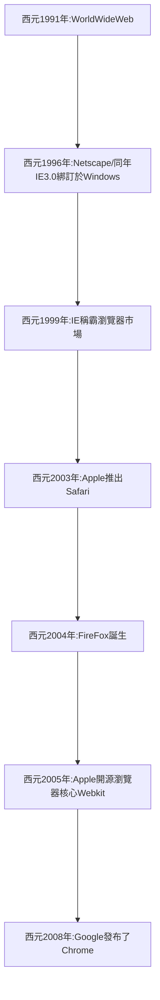

瀏覽器的前世今生
===
# 各大瀏覽器：


<div style="float:left;width:100%;">
    
<div style="width:50%; float:left;">
    
### 各大瀏覽器：   
    
**WorldWideWeb**
:::info
    WorldWideWeb:
誕生於西元1991年, 是在NeXTSTEP作業系統開發而成的第一個網頁瀏覽器
:::spoiler
1. WorldWideWeb的第一個網址:(http://info.cern.ch/)
2. NeXTSTEP作業系統:運行在NeXT電腦上的作業系統
3. NeXT電腦:已故蘋果公司CEO賈伯斯所推出的個人電腦
:::

**Mozilla**
:::info
    FireFox:
誕生於西元2004年, 是由Mozilla基金會開發的網頁瀏覽器
:::spoiler
1. Mozilla創立於西元1998年，起源於Netscape公司 (基金會成員多為此公司之員工)
2. Netscape公司之同名瀏覽器:Netscape曾在西元1996年短暫擁有近86%的市佔率，但隨後幾年即被Internet Explorer(IE)所拿下
:::

**Microsoft: IE/Edge**
:::info
    IE:
IE1.0誕生於西元1995年, 是由Microsoft所推出的網頁瀏覽器
:::spoiler
1. 於西元1996年綁訂於自家作業系統上，從此一路拿下市占率，市占率於西元1999年，一度來到可怕的99%
2. IE稱霸了一段時間後，由於性能及使用者體驗的關係，市佔率漸漸被後來崛起的Safari及Chrome所吞併
:::

:::info
    Edge
由於市佔率的掉落，Microsoft終於在西元2015年推出了基於Webkit渲染引擎的瀏覽器: Edge
:::spoiler
1. Webkit: 由Apple: Safari開源的瀏覽器核心
2. IE及Edge的差異在於: IE使用的渲染引擎是自家開發的: Trident
:::

**Apple**
:::info
    Safari:
誕生於西元2003年, 是由Apple開發的網頁瀏覽器
:::spoiler
1. 2005開源了Safari使用的瀏覽器核心: Webkit，由此開啟了瀏覽器的新世界
:::

**Google**
:::info
    Chrome:
Google於西元2008年基於瀏覽器核心: Webkit發布了項目: Chromium，隨後進一步推出了當代最廣為使用的網頁瀏覽器: Chrome
:::spoiler
1. Chrome, 發布了他們的新瀏覽器核心: Blink以及Javascript解析引擎V8，而之後基於V8誕生的Node.js正式揭開了前端工程化的序幕
2. Node.js: 以JavaScript語言為基礎，使用了V8引擎的高效能、易擴充的網站應用程式開發框架
:::    
    
</div>


<div style="width:50%; float:right;">
 
### 瀏覽器的歷史進展：   
       


``` 
Netscape: FireFox的前身
```

</div>

<div style="float:none;clear:both;">
    
</div>
   
    
[參考資料: How Browsers Work: Behind the scenes of modern web browsers](https://www.html5rocks.com/en/tutorials/internals/howbrowserswork/)
###### tags: `書本模式`