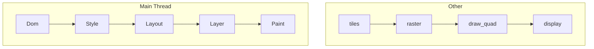

渲染引擎運作機制:Reflow 與 Repaint
===

### 渲染流程圖:   

### Reflow 與 Repaint:   

:::info
我們可以將上圖分成兩個部分來看: 主執行緒和非主執行緒
:::

:::info
接著我們將畫面的元件屬性分成兩類: 幾何屬性和非幾何屬性
:::

**幾何屬性:
如: width, position, float**

**非幾何屬性:
如: opacity, color, background-color, visibility**

==幾何屬性的變動會讓整個渲染流程重新執行一次: 重排(Reflow)==

==非幾何屬性的變動則只會讓Layer之後的渲染流程重新執行一次: 重繪(Repaint)==

:::info
但是不論哪個都會占用到渲染流程的主執行緒，又因為JavaScript(處理使用者頁面的交互邏輯)也是在此執行，所以如果再JavaScript中存在大量需要重排(Reflow)或是重繪(Repaint)的程式碼，便可能造成渲染流程的阻塞，進而影響使用者體驗
:::
:::info
因此若能選擇用不占用渲染流程的主執行緒的Compositing來實現頁面的動態效果，便能大大提升渲染流程的順暢度
如: **CSS的transform屬性**
:::

==Compositing的運作不是在 Main Thread 進行的，而是在 Compositor Thread 與 Raster Thread，因此不會佔用 Main Thread 資源==

    
[參考資料: 身為-web-工程師-你應該要知道的瀏覽器架構演進史-feat-渲染引擎運作機制](https://medium.com/starbugs/%E8%BA%AB%E7%82%BA-web-%E5%B7%A5%E7%A8%8B%E5%B8%AB-%E4%BD%A0%E6%87%89%E8%A9%B2%E8%A6%81%E7%9F%A5%E9%81%93%E7%9A%84%E7%80%8F%E8%A6%BD%E5%99%A8%E6%9E%B6%E6%A7%8B%E6%BC%94%E9%80%B2%E5%8F%B2-feat-%E6%B8%B2%E6%9F%93%E5%BC%95%E6%93%8E%E9%81%8B%E4%BD%9C%E6%A9%9F%E5%88%B6-6d95d4d960ee)

###### tags: `書本模式`